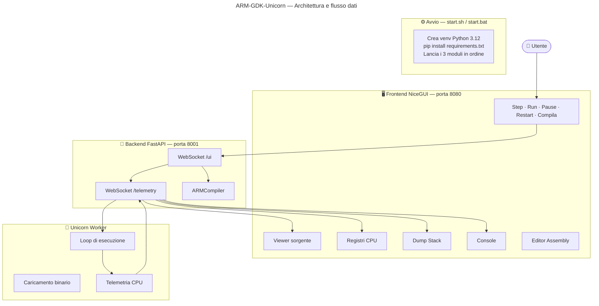

# ARM-GDK-Unicorn

ARM-GDK-Unicorn è un ambiente didattico per lo sviluppo, l'esecuzione e il debug di programmi **ARMv7 Assembly**, realizzato interamente in Python.

Il progetto combina:

* **Keystone Engine** per l'assemblaggio del codice ARM;
* **Unicorn Engine** per l'emulazione della CPU ARMv7;
* **FastAPI** come hub di comunicazione;
* **NiceGUI** per l'interfaccia grafica web.

L'obiettivo è fornire una piattaforma semplice e comprensibile per studenti, docenti e appassionati di architettura dei calcolatori che desiderano osservare il comportamento interno di un processore ARM durante l'esecuzione di un programma Assembly.

---

# Caratteristiche principali

* Compilazione Assembly ARMv7 direttamente dal browser.
* Emulazione ARMv7 tramite Unicorn Engine.
* Debug passo-passo (Step).
* Esecuzione continua (Run).
* Pausa dell'esecuzione.
* Restart del programma.
* Gestione breakpoint.
* Visualizzazione registri CPU.
* Visualizzazione Stack.
* Console di output.
* Editor Assembly integrato.
* Aggiornamento dello stato in tempo reale tramite WebSocket.

---

# Architettura

Il sistema è composto da tre moduli indipendenti:

1. **Frontend NiceGUI**
2. **Backend FastAPI**
3. **Worker Unicorn**

La comunicazione avviene esclusivamente tramite WebSocket.

```text
Frontend ↔ Backend ↔ Unicorn Worker
```

## Diagramma Mermaid



---

# Struttura del progetto

```text
ARM-GDK-Unicorn/
│
├── start.sh
├── start.bat
├── requirements.txt
├── main.elf
│
├── src/
│   └── main.s
│
├── app/
│   ├── backend/
│   │   ├── main.py
│   │   └── core_compiler.py
│   │
│   ├── emulator/
│   │   └── unicorn_worker.py
│   │
│   └── frontend/
│       └── run.py
│
└── env/
```

---

# Componenti

## Frontend

Percorso:

```text
app/frontend/run.py
```

Responsabilità:

* Editor Assembly
* Visualizzazione registri
* Visualizzazione stack
* Gestione breakpoint
* Console di output
* Invio comandi al backend

Porta:

```text
http://localhost:8080
```

---

## Backend

Percorso:

```text
app/backend/main.py
```

Responsabilità:

* Gestione WebSocket
* Compilazione del codice
* Smistamento dei messaggi
* Coordinamento tra GUI ed emulatore

Endpoint:

```text
/ws/ui
/ws/telemetry
```

---

## Compilatore ARM

Percorso:

```text
app/backend/core_compiler.py
```

Basato su:

* Keystone Engine

Funzionalità:

* Parsing Assembly GNU ARM
* Gestione label
* Gestione sezioni .text e .data
* Produzione del flat binary

Indirizzi principali:

```text
CODE_ADDRESS = 0x10000
DATA_ADDRESS = 0x20000
```

---

## Emulatore

Percorso:

```text
app/emulator/unicorn_worker.py
```

Basato su:

* Unicorn Engine

Funzionalità:

* Esecuzione ARMv7
* Step-by-step execution
* Gestione breakpoint
* Hook syscall Linux

Syscall supportate:

| Syscall | Descrizione |
| ------- | ----------- |
| 1       | exit        |
| 4       | write       |

---

# Installazione

## Requisiti

* Python 3.12+
* pip

---

## Dipendenze

```bash
pip install -r requirements.txt
```

Pacchetti principali:

```text
fastapi
uvicorn
nicegui
websockets
keystone-engine
unicorn
websocket-client
pyelftools
```

---

# Avvio

## Linux / macOS

```bash
chmod +x start.sh
./start.sh
```

## Windows

```cmd
start.bat
```

Lo script:

1. crea il virtual environment;
2. installa le dipendenze;
3. avvia Backend;
4. avvia Frontend;
5. avvia Unicorn Worker.

---

# Workflow

1. Scrivere Assembly ARM nell'editor.
2. Premere **Compila**.
3. Premere **Restart**.
4. Eseguire:

   * Step
   * Run
   * Pause
5. Analizzare:

   * registri;
   * stack;
   * output console.

---

# Caso d'uso didattico

ARM-GDK-Unicorn è pensato per:

* corsi di Architettura degli Elaboratori;
* Sistemi Operativi;
* Programmazione Assembly ARM;
* Reverse Engineering;
* studio delle syscall Linux ARM;
* laboratori universitari.

---

# Tecnologie utilizzate

| Tecnologia      | Ruolo                   |
| --------------- | ----------------------- |
| Python          | Linguaggio principale   |
| FastAPI         | Backend                 |
| NiceGUI         | Frontend                |
| WebSocket       | Comunicazione real-time |
| Keystone Engine | Assembler ARM           |
| Unicorn Engine  | Emulatore ARM           |
| PyELFTools      | Supporto ELF            |

---

# Licenza

Progetto sviluppato a scopo didattico e di ricerca.

Verificare eventuali licenze delle librerie di terze parti utilizzate (Keystone Engine, Unicorn Engine, FastAPI, NiceGUI).
